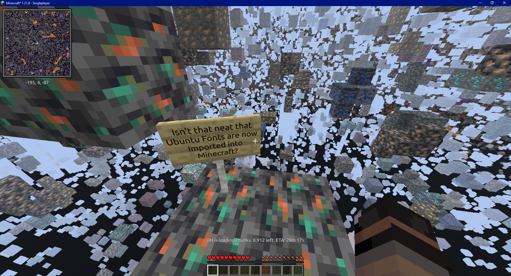
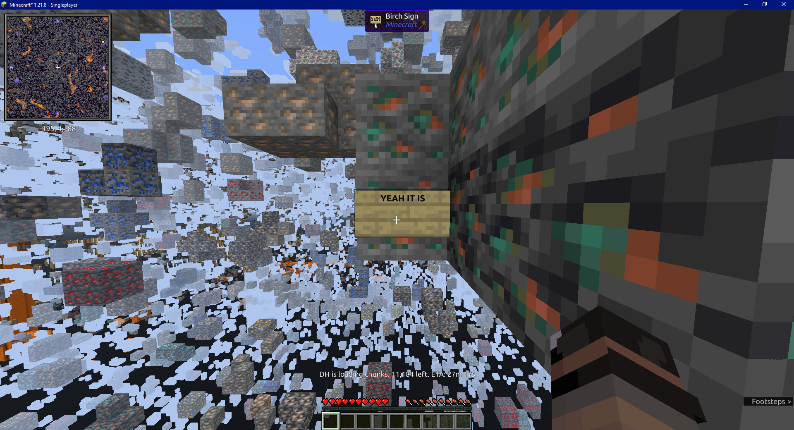
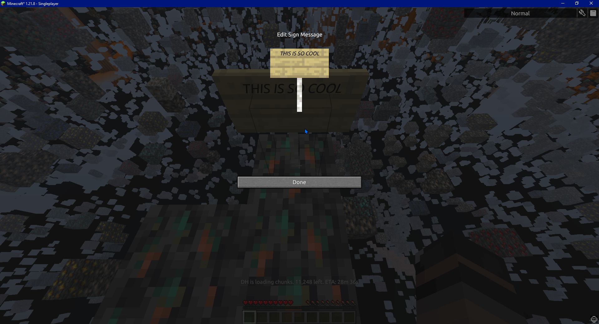

# Kucaxttgeyes
A Texture Pack (which is pronounced "Ku Caxts thy ki eyes") for JE with Caxton mod installed.

The one Texture Pack that brings Ubuntu Desktop's Fonts (no Mono or Propo though, as these ones will be separate from the actual Ubuntu Fonts Pack)

I Say Ubuntu **FONTS** because unlike the other font pack, this one actually comes with Bold and Italic fonts, which means it is the same it was before, other than it's Ubuntu instead of what I call Minecraftia Fonts

Screenshots:

Main Menu:

Bold Font Demo:

Italic Font Demo:

